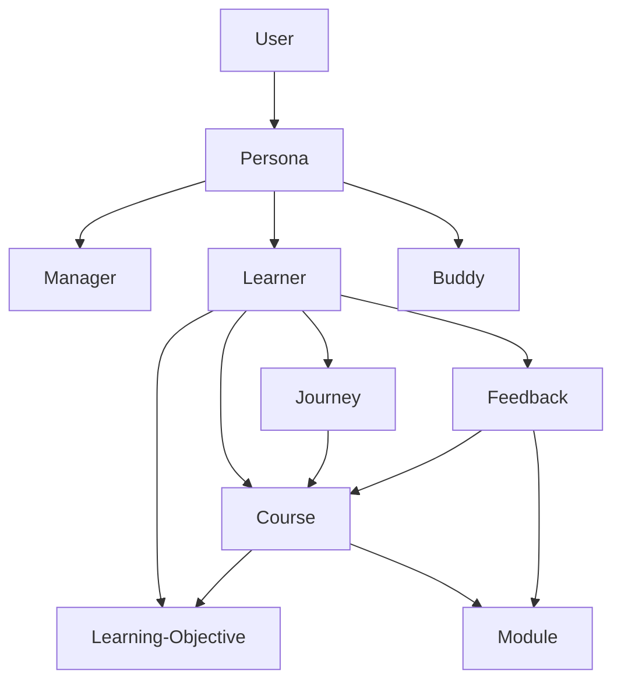

# Lore Documentation

Reference article: [Learn-B: a social analytics-enabled tool for self-regulated workplace learning](https://dl.acm.org/doi/abs/10.1145/2330601.2330632)

Miro [board](https://miro.com/app/board/uXjVIJHbNbo=/)

